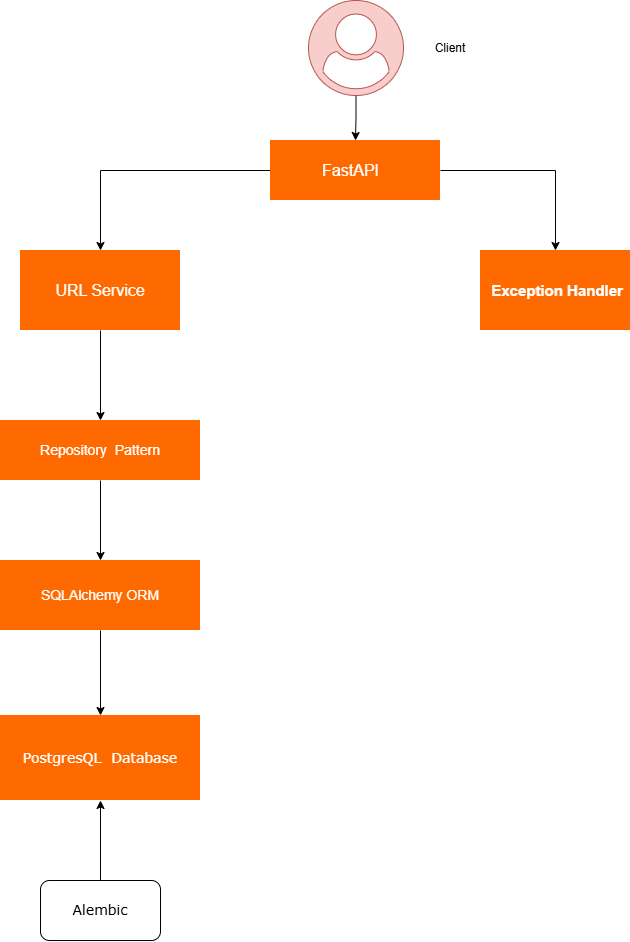

# 🔐 Shortn – A Production-Grade Secure URL Shortener

> **Building a production-ready backend the way modern engineering teams do.**

> This project is more than a URL shortener. It is a hands-on DevSecOps learning project focused on building, securing, testing, containerising and deploying a real-world backend using modern engineering practices.

---

# 🎯 Project Goal

The goal is to demonstrate how a backend application evolves from a simple FastAPI application into a **production-grade cloud-native service** following industry best practices.

The project focuses on:

- Clean Architecture
- Secure Coding Practices
- Database Migrations
- Observability
- Infrastructure as Code
- CI/CD
- Kubernetes
- DevSecOps

---

# 📚 Why I Built This Project

As someone transitioning into **DevOps, Platform Engineering and DevSecOps**, I wanted a project that demonstrates more than the ability to deploy containers.

This project allows me to practise and demonstrate:

- Backend Engineering
- Software Architecture
- Infrastructure
- Secure Development
- CI/CD
- Cloud Native Engineering
- Production Readiness

Every feature is implemented incrementally with an emphasis on understanding _why_ each engineering decision is made.

---

# 💡 What Recruiters and Hiring Managers Will Find Here

This repository demonstrates practical experience with:

- Designing REST APIs
- Clean Architecture
- SQLAlchemy ORM
- PostgreSQL
- Database Migrations
- FastAPI Dependency Injection
- Layered Application Design
- Exception Handling
- Request Validation
- Secure Coding Principles
- DevSecOps Practices
- Production-Ready Backend Development

---

## 📌 Project Status

> **🚧 Active Development**

This project is currently being built in public as part of my journey into **Platform Engineering, DevOps and DevSecOps**.

Rather than rushing to the final product, I am intentionally implementing each component as it would be built in a real software engineering team—from architecture and clean code to CI/CD, Kubernetes and observability.

Current Progress:

- ✅ FastAPI REST API
- ✅ PostgreSQL Integration
- ✅ SQLAlchemy ORM
- ✅ Repository Pattern
- ✅ Service Layer
- ✅ Dependency Injection
- ✅ URL Creation
- ✅ Collision Detection
- ✅ URL Redirection
- ✅ Global Exception Handling
- ✅ Request Validation
- ✅ Alembic Database Migrations
- 🚧 Structured Logging
- ⏳ Automated Testing
- ⏳ Docker
- ⏳ GitHub Actions CI
- ⏳ Security Scanning
- ⏳ Kubernetes Deployment
- ⏳ Monitoring & Observability

---

# 🏗️ High-Level Architecture



---

# 🧠 Design Principles

This project intentionally follows common backend engineering practices.

- Separation of Concerns
- Dependency Injection
- Repository Pattern
- Service Layer Pattern
- SOLID Principles
- Configuration via Environment Variables
- Database Version Control
- Centralised Logging
- Secure-by-Default Design

---

# 📂 Project Structure

```
shortnd/
│
├── api/
│   ├── app/
│   │   ├── exceptions/
│   │   ├── repositories/
│   │   ├── services/
│   │   ├── logging/
│   │   ├── config.py
│   │   ├── database.py
│   │   ├── models.py
│   │   ├── schemas.py
│   │   ├── main.py
│   │   └── ...
│   │
│   ├── alembic/
│   ├── alembic.ini
│   └── requirements.txt
│
├── docker-compose.yml
├── .env.example
├── README.md
└── .gitignore
```

---

# 🚀 Features Implemented

## URL Creation

Users submit a long URL.

The API:

- validates the request
- generates a secure random short code
- checks for collisions
- stores the mapping
- returns the shortened URL

---

## Collision Detection

Short codes are generated using Python's `secrets` module.

Before saving:

- the repository checks if the code already exists
- retries are performed
- an exception is raised if uniqueness cannot be guaranteed

---

## URL Redirection

A request to

```
GET /{short_code}
```

retrieves the original URL from PostgreSQL and redirects the client using HTTP 302.

---

## Database Persistence

URL mappings are stored in PostgreSQL.

Current table:

```
urls
```

Fields include:

- UUID Primary Key
- Original URL
- Short Code
- Created Timestamp

---

## Repository Pattern

Database access is isolated from business logic.

Responsibilities include:

- Create URL
- Find by short code
- Future CRUD operations

---

## Service Layer

Contains the application's business logic.

Responsibilities include:

- Generate short codes
- Detect collisions
- Create shortened URLs
- Retrieve original URLs

---

## Dependency Injection

FastAPI's dependency injection is used to inject:

- Database Session
- Repository
- Service

This keeps components loosely coupled and easy to test.

---

## Request Validation

Incoming requests are validated using Pydantic.

Invalid requests are rejected before reaching the business logic.

---

## Global Exception Handling

Custom exceptions provide consistent API responses.

Examples include:

- URL Not Found
- Validation Errors
- Runtime Exceptions

---

## Database Migrations

Schema changes are managed using Alembic instead of:

```python
Base.metadata.create_all()
```

Benefits:

- Version controlled schema
- Repeatable deployments
- Rollback support
- Production-ready workflow

---

# 🛠️ Technology Stack

### Backend

- Python
- FastAPI

### Database

- PostgreSQL
- SQLAlchemy
- Alembic

### Validation

- Pydantic

### Containerisation

- Docker
- Docker Compose _(in progress)_

### CI/CD

- GitHub Actions _(planned)_

### Security

- Trivy _(planned)_
- Bandit _(planned)_
- Snyk _(planned)_

### Cloud Native

- Kubernetes _(planned)_

### Monitoring

- Prometheus _(planned)_
- Grafana _(planned)_
- OpenTelemetry _(planned)_

---

# 🔒 Security Considerations

Security is being built into the project from the beginning.

Current practices include:

- Environment Variables
- UUID Primary Keys
- Secure Random Short Code Generation
- Input Validation
- Layered Architecture
- Exception Handling

Future improvements include:

- Rate Limiting
- API Authentication
- HTTPS
- Security Headers
- Dependency Scanning
- Container Image Scanning
- Secret Management

---

# 🧪 Planned Testing

The following testing strategy will be implemented.

- Unit Tests
- Repository Tests
- Service Tests
- API Tests
- Integration Tests

---

# 📦 Deployment Roadmap

The application will eventually be deployed using:

- Docker
- Docker Compose
- GitHub Actions
- Kubernetes
- NGINX Ingress
- Prometheus
- Grafana

---

# 📈 Roadmap

## Phase 1

- [x] FastAPI
- [x] PostgreSQL
- [x] SQLAlchemy
- [x] Repository Pattern
- [x] Service Layer
- [x] URL Creation
- [x] Collision Detection
- [x] URL Redirection

---

## Phase 2

- [x] Alembic
- [x] Exception Handling
- [x] Request Validation
- [🚧] Structured Logging
- [ ] Health Checks

---

## Phase 3

- [ ] Automated Testing
- [ ] Docker
- [ ] Docker Compose
- [ ] GitHub Actions
- [ ] Code Quality Checks

---

## Phase 4

- [ ] Kubernetes
- [ ] Ingress
- [ ] Secrets
- [ ] ConfigMaps
- [ ] Autoscaling

---

## Phase 5

- [ ] Prometheus
- [ ] Grafana
- [ ] OpenTelemetry
- [ ] Centralised Logging

---

## Engineering Challenges Solved

### Alembic Initial Migration Issue

While setting up database migrations, Alembic generated an empty initial migration (`upgrade()` contained only `pass`), resulting in the migration history being applied without creating the `urls` table.

#### Root Cause

The initial migration was generated before Alembic was correctly configured to discover the SQLAlchemy models via `Base.metadata`.

#### Resolution

- Verified Alembic configuration (`env.py`)
- Confirmed SQLAlchemy model registration
- Generated a temporary migration to validate model discovery
- Removed the invalid migration
- Regenerated the initial migration
- Successfully applied the migration to both the development and test databases

#### Outcome

The project now maintains consistent database schemas across development and testing using Alembic migrations.

# 🤝 Setup Instructions

- Clone the repository
  [Shortn](https://github.com/elkumah/shortnd.git)

---

# 📬 Connect With Me

I'm actively documenting this project and sharing what I'm learning.

- **[LinkedIn]** (https://www.linkedin.com/in/emmanuel-fordjour/)
- **[YouTube]** (https://www.youtube.com/@DevOpsWithEmma)

---
