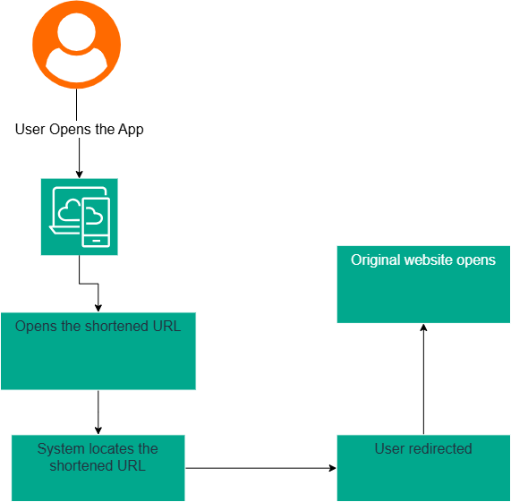
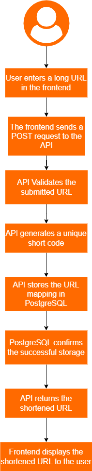
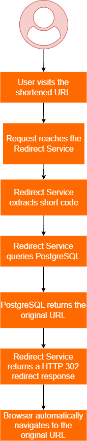

# Project Overview

The Secure URL Shortener Platform enables users to convert long URLs into shorter, shareable links. The platform provides a simple user experience where users can create a shortened URL and use it to redirect visitors to the original destination.

# User Flow

This section describes the journey from the perspective of the user without focusing on the underlying technical implementation.

## Primary User Flow

### URL Creation Flow

### Flow Description

- The user opens the URL Shortener application.
- The user enters a valid long URL into the input field. Example : `https://www.example.com/blog/devsecops-best-practices`
- User clicks the shorten url button
- Platform generates a unique shortened URL. Example: `https://short.ly/abc123`
- The shortened URL is displayed to the user.
- The user copies, saves or shares the shortened URL.

### URL Redirect Flow

### Flow Description

- User clicks on shortened url. Example: `https://short.ly/abc123`
- The platform identifies the original URL associated with the shortened link.
- The user is automatically redirected to the destination URL.
- The original website loads in the user's browser.

### Error Flow

### Flow Description

- The user enters an invalid URL.
- The platform validates the submitted URL.
- If validation fails and error message is displayed. Example: `Please enter a valid URL`
- The user corrects the URL and submits it again.

## User Goals

The primary goals of the user are:

- Convert the long URLs into shorter links.
- Easily share the shortened URLs.
- Quickly access original destination through shortened links.
- Receive immediate feedback when invalid URLs are submitted.

## Success Criteria

The user flow is considered successful when:

- The user submits a valid URL.
- A unique shortened URL is generated.
- The shortened URL is displayed correctly.
- Visiting the shortened URL redirects the user to the correct destination.

## URL Creation Service Flow

The URL Creation Service Flow describes how the frontend, API service, and database interact when creating a shortened URL.

### Participants

- Frontend service
- API service
- PostgreSQL Database

## URL Redirect Service Flow

The URL Redirect Service Flow describes how requests to shortened URLs are processed and redirected to the original destination.

### Participants

- Browser
- Redirect Service
- PostgreSQL Database

# Database Design

# Infrastructure Architecture

# Security Architecture

# Observability Architecture
