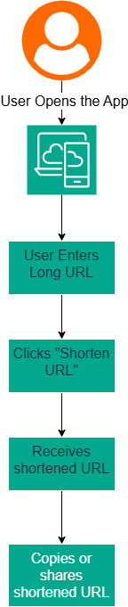

# Project Overview

The Secure URL Shortener Platform enables users to convert long URLs into shorter, shareable links. The platform provides a simple user experience where users can create a shortened URL and use it to redirect visitors to the original destination.

# User Flow

This section describes the journey from the perspective of the user without focusing on the underlying technical implementation.

## Primary User Flow

### URL Creation Flow

## Flow Description

- The user opens the URL Shortener application.
- The user enters a valid long URL into the input field. Example : `https://www.example.com/blog/devsecops-best-practices`
- User clicks the shorten url button
- Platform generates a unique shortened URL. Example: `https://short.ly/abc123`
- The shortened URL is displayed to the user.
- The user copies, saves or shares the shortened URL.

# Service Flow

# Database Design

# Infrastructure Architecture

# Security Architecture

# Observability Architecture
